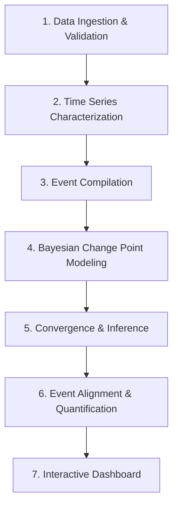

# Task 1 Report: Laying the Foundation for Change Point Analysis

**Author:** Data Science Team, Birhan Energies  
**Subject:** Brent Crude Oil Price Analysis & Planning  

---

## 1. Planned Data Analysis Workflow

To systematically study the impact of geopolitical, OPEC, and macroeconomic events on Brent oil prices, we follow a rigorous 7-stage analytical pipeline:

1. **Data Ingestion & Validation**: Load daily Brent oil prices, convert date formats, check for missing values, handle duplicated entries, and ensure positive prices.
2. **Time Series Characterization**: Perform exploratory data analysis (EDA), trend analysis, stationarity testing (ADF test), and volatility clustering visualization.
3. **Event Compilation**: Build a structured dataset of OPEC, geopolitical, and economic shocks to provide external labels for historical shifts.
4. **Bayesian Change Point Modeling**: Formulate a change point model in PyMC using MCMC sampling to detect structural breaks without prior labels.
5. **Convergence & Inference**: Verify model convergence via Gelman-Rubin ($\hat{R}$) diagnostics, auto-correlation checks, and trace plot examination.
6. **Event Alignment & Impact Quantification**: Quantify the before/after mean shifts and run temporal window alignment to link events to structural changes.
7. **Interactive Dashboard**: Build a Flask API backend and React frontend dashboard to present the historical trends, events, and change points.

---

## 2. Compiled Event Dataset (Summary of Research)

Our finalized events dataset contains **19 key events** spanning 1973 to 2022. Out of these, **16 events** fall directly within the Brent Oil Price dataset window (1987-05-20 to 2022-11-14). 

| Date | Event Name | Category | Severity | Expected Impact Summary |
|:---|:---|:---|:---|:---|
| 1973-10-19 | OPEC Oil Embargo | OPEC Policy / Geopolitical | High | quadrupled prices due to supply embargo |
| 1979-01-01 | Iranian Revolution | Geopolitical / Supply Shock | High | Severe supply reductions, triggering second oil crisis |
| 1980-09-22 | Iran-Iraq War | Geopolitical / Supply Shock | High | Extended export disruptions from both countries |
| **1990-08-02** | **Iraq Invasion of Kuwait** | **Geopolitical** | **High** | Immediate price surge due to supply disruption fears |
| **1991-01-17** | **Operation Desert Storm** | **Geopolitical / Supply Shock** | **High** | High volatility and war risk premium on crude oil |
| **1997-11-27** | **OPEC Jakarta Quota Increase** | **OPEC Policy** | **Medium** | Oversupply quota increase just before Asian Financial Crisis |
| **1997-12-01** | **Asian Financial Crisis Impact** | **Economic Shock** | **High** | Collapsed demand, leading to prices dropping below $10/barrel |
| **2001-09-11** | **9/11 Terrorist Attacks** | **Geopolitical / Economic** | **High** | Demand destruction due to travel halts and global slowdown |
| **2003-03-20** | **US Invasion of Iraq** | **Geopolitical** | **High** | Price increase due to security risk and Iraqi output disruption |
| **2008-07-01** | **Global Financial Crisis Peak** | **Economic Shock** | **High** | Oil prices peak at record $147/bbl before dropping to $35/bbl |
| **2008-12-17** | **OPEC Oran Production Cut** | **OPEC Policy** | **High** | Record 2.2 million b/d cut to counter GFC price collapse |
| **2011-02-15** | **Libyan Civil War** | **Geopolitical** | **High** | Libyan oil production halt, causing a supply deficit |
| **2014-11-27** | **OPEC Maintains Production** | **OPEC Policy** | **High** | Steep price drop as OPEC keeps output high to squeeze US shale |
| **2016-11-30** | **OPEC+ Vienna Agreement** | **OPEC Policy** | **High** | OPEC and Russia form OPEC+ alliance, cutting output to stabilize |
| **2019-09-14** | **Saudi Aramco Drone Attacks** | **Geopolitical / Supply Shock** | **High** | Abqaiq attacks cut 5% of global supply; record single-day surge |
| **2020-03-09** | **COVID-19 & OPEC+ Price War** | **Economic / OPEC Policy** | **High** | Demand collapse + Saudi-Russia price war causes price crash |
| **2020-04-12** | **OPEC+ Historic Production Cut** | **OPEC Policy** | **High** | Unprecedented 9.7 million b/d cut to stabilize market |
| **2020-04-20** | **WTI Crude Hits Negative Pricing** | **Economic Shock** | **High** | Physical oversupply and storage exhaust forces negative futures |
| **2022-02-24** | **Russia-Ukraine Conflict** | **Geopolitical / Economic** | **High** | Sanctions on Russia shift flows, sending Brent above $120/bbl |

---

## 3. Assumptions and Limitations

### Statistical Correlation vs. Causal Impact
A fundamental challenge in time-series modeling is separating **correlation in time** from **causal impact**.
* **Coincidental Timing**: If the model detects a change point around March 2003, we might attribute it to the *US Invasion of Iraq*. However, this timing alone does not prove causality. Other factors—such as China's rapid industrialization driving global demand or US dollar depreciation—were also occurring.
* **Confounding Variables**: Oil prices are determined by simultaneous demand (GDP growth, seasonal factors) and supply (non-OPEC production, technology, OPEC quotas), plus financial speculation. Without controlling for these, attributing a mean shift to a single event risks *post hoc ergo propter hoc* fallacy.

### Model Assumptions and Limitations
1. **Sudden Step Shifts**: Standard change point models (such as the switch function `pm.math.switch`) assume that parameters change *instantly* at index $\tau$. In reality, market adjustments are often gradual, displaying drifts or smooth transitions.
2. **Mean-Only Shifts**: A model that changes only its mean ($\mu_1 \to \mu_2$) assumes constant volatility $\sigma$. However, geopolitical shocks typically trigger severe volatility clustering, meaning $\sigma$ is not constant.
3. **Single vs. Multiple Change Points**: A single switch point model can only identify the most dominant break in the dataset. Since Brent oil prices have multiple structural regimes over 35 years, a single-change-point model must be run on sub-windows of the data to be useful.

---

## 4. Time Series Properties Findings

We analyzed the Brent Crude oil daily price dataset (9,011 rows, May 20, 1987, to November 14, 2022) for three core properties:

### A. Trend Analysis
* **1987-1999 (Low Stability)**: Prices fluctuated in a low, stable range ($10 - $25/bbl). The Asian Financial Crisis (1997-1998) drove prices to historic lows.
* **2000-2008 (Commodities Supercycle)**: Prices rose from $25 to a record peak of $143.95/bbl in July 2008, driven by massive emerging market demand (especially China).
* **2008-2009 (GFC Crash & Recovery)**: Prices fell to $36/bbl in late 2008, followed by a V-shaped recovery.
* **2010-2014 (High-Price Era)**: Prices consolidated above $100/bbl, supported by supply disruptions (Libya, Arab Spring).
* **2014-2016 (Shale Shock)**: Prices crashed to $30/bbl due to the US shale boom and OPEC's decision to defend market share rather than cut output.
* **2020 (COVID-19 Collapse)**: Prices fell below $20/bbl due to pandemic lockdowns, before recovering.
* **2022 (War Risk Premium)**: Russian invasion of Ukraine sent prices back over $120/bbl.

### B. Stationarity Testing
To determine if prices are stationary, we performed the **Augmented Dickey-Fuller (ADF) test**:

* **Raw Price Series**: 
  * ADF Statistic: $-1.88$ (p-value: $0.34$)
  * **Result**: We fail to reject the null hypothesis of a unit root. The raw price series is **non-stationary** and contains a strong stochastic trend.
* **Log Returns Series**:
  * ADF Statistic: $-22.56$ (p-value: $<0.0001$)
  * **Result**: The null hypothesis is rejected with extreme significance. Log returns are **stationary**, making them suitable for models that require stationary inputs.

### C. Volatility Patterns
Oil prices exhibit strong **volatility clustering**:
* Periods of low price movement (calm regimes) are followed by low volatility, while large shifts (shocks) trigger high volatility.
* Visual analysis of log returns reveals significant volatility spikes during the 1990 Gulf War, the 2008 Financial Crisis, the 2014 OPEC market share war, and the 2020 COVID-19 pandemic. This suggests that models assuming a constant standard deviation ($\sigma$) over long periods are misspecified, and that a regime-switching or time-varying volatility model (like GARCH) is more appropriate for future work.
